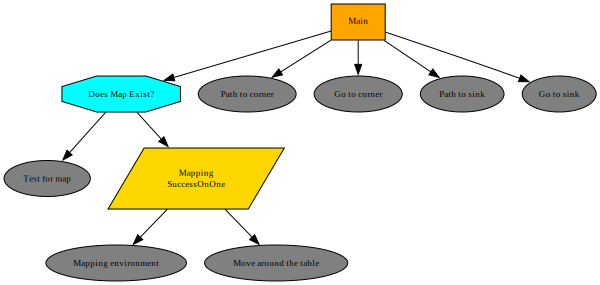

# Mapping and Navigation with Behavior Trees (TIAGo Robot)

This project implements an autonomous mapping and navigation system for a **TIAGo robot** using **Behavior Trees** (`py_trees`) within the **Webots** robotics simulator.

The robot's behavior is controlled by a decision tree that seamlessly transitions between mapping an unknown environment and navigating to specific waypoints once the map is generated.

## Features

- **Behavior Tree Architecture**: Uses `py_trees` to orchestrate complex tasks like checking map existence, exploring the environment, and executing path planning.
- **Autonomous Mapping**: If no map is found, the robot autonomously explores the environment (e.g., moving around a table) to generate and save a configuration space map (`cspace.npy`).
- **Waypoint Navigation**: Once the map is available, the robot computes paths and navigates to predefined targets, such as the left corner and the sink.
- **Headless Mode Support**: Run the simulation without the Webots GUI for faster execution and automated testing.

## Prerequisites

- **Webots**: Ensure the Webots simulator is installed and available in your system path.
- **Python 3**: Requires Python 3.x.
- **Python Packages**:
  ```bash
  pip install py_trees numpy
  ```

## Project Structure

- `tiago_bt.py`: The main entry point for the Behavior Tree controller. Defines the tree structure and runs the main control loop.
- `run_headless.py`: A helper script to run the Webots simulation in headless (CLI) mode.
- `behavior_tree/`: Contains the custom Behavior Tree nodes (`check_map`, `map_running`, `navigation_nodes`).
- `tiago_robot/`: Contains the Python interface to control the TIAGo robot within Webots.
- `map_save/`: Directory where generated maps (e.g., `cspace.npy`) are stored.
- `mapping/` & `navigation/`: Additional modules for mapping and path computation algorithms.

## Usage

You can run the simulation using the provided `run_headless.py` script. The script supports different modes.

### 1. Full Behavior Tree Mode (Default)
Runs the complete behavior tree: Checks for a map -> Mapps the environment if needed -> Navigates to the corner -> Navigates to the sink.
```bash
python run_headless.py
# or
python run_headless.py --mode bt
```

### 2. Mapping Only Mode
Forces the robot to explore the environment and save the `cspace.npy` map.
```bash
python run_headless.py --mode mapping
```

### 3. Navigation Only Mode
Loads the existing `cspace.npy` map and navigates directly to the goals. Requires mapping to be completed first.
```bash
python run_headless.py --mode navigation
```

### Additional Options
- Specify a custom Webots world file:
  ```bash
  python run_headless.py --world /path/to/custom_world.wbt
  ```
- Run in real-time instead of fast mode:
  ```bash
  python run_headless.py --no-fast
  ```

## Behavior Tree Flow



1. **Selector: "Does Map Exist?"**
   - Tries to find an existing map.
   - If it fails, falls back to the **Mapping** sequence (Parallel node: "Mapping environment" + "Move around the table").
2. **Sequence: "Main"**
   - After the map check/creation, computes a path to the `LEFT_CORNER` and moves there.
   - Computes a path to the `SINK_POINT` and moves there.
3. If all sequences succeed, the mission is marked as complete.